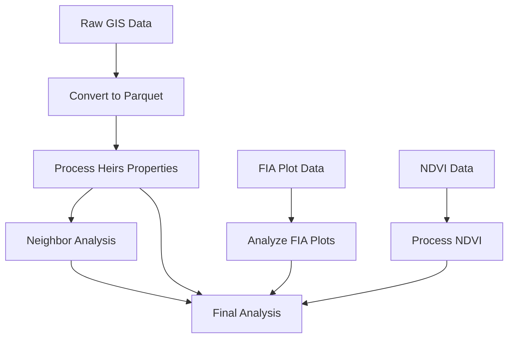

# Heirs Property - Project Scope

---

## **IMPORTANT: PROJECT CONTINUITY**  
To maintain project context across conversations, always start a new chat with the following instructions:  

```
You are working on the Heirs Property project
Read CHANGELOG.md and PROJECT_SCOPE.md now, report your findings, and strictly follow all instructions found in these documents.  
You must complete the check-in process before proceeding with any task.  

Begin check-in process and document analysis.
```

---

## **IMPORTANT: SELF-MAINTENANCE INSTRUCTIONS**  

### **Before Taking Any Action or Making Suggestions**  
1. **Read Both Files**:  
   - Read `CHANGELOG.md` and `PROJECT_SCOPE.md`.  
   - Immediately report:  
     ```
     Initializing new conversation...  
     Read [filename]: [key points relevant to current task]  
     Starting conversation history tracking...
     ```

2. **Review Context**:  
   - Assess existing features, known issues, and architectural decisions.  

3. **Inform Responses**:  
   - Use the gathered context to guide your suggestions or actions.  

4. **Proceed Only After Context Review**:  
   - Ensure all actions align with the project’s scope and continuity requirements.

---

### **After Making ANY Code Changes**  
1. **Update Documentation Immediately**:  
   - Add new features/changes to the `[Unreleased]` section of `CHANGELOG.md`.  
   - Update `PROJECT_SCOPE.md` if there are changes to architecture, features, or limitations.

2. **Report Documentation Updates**:  
   - Use the following format to report updates:  
     ```
     Updated CHANGELOG.md: [details of what changed]  
     Updated PROJECT_SCOPE.md: [details of what changed] (if applicable)
     ```

3. **Ensure Alignment**:  
   - Verify that all changes align with existing architecture and features.

4. **Document All Changes**:  
   - Include specific details about:
     - New features or improvements
     - Bug fixes
     - Error handling changes
     - UI/UX updates
     - Technical implementation details

5. **Adhere to the Read-First/Write-After Approach**:  
   - Maintain explicit update reporting for consistency and continuity.

---

## **Project Overview**
A spatial data analysis system for tracking and analyzing heirs property parcels in North Carolina.

### **Project Status**
- Phase 1 (Infrastructure): ✅ Complete
  - Docker environment setup
  - PostGIS database configuration
  - Development environment setup
  - Testing framework implementation
  - Documentation structure established

- Phase 2 (Data Pipeline): 🔄 In Progress
  - Data ingestion framework
  - Processing pipeline implementation
  - Initial analysis tools
  - Database optimization
  - Testing coverage expansion

- Phase 3 (Analysis Tools): 📅 Planned
  - Advanced spatial analysis
  - Visualization tools
  - Reporting framework
  - Performance optimization
  - Automated reporting

### **Implementation Timeline**

#### Phase 1: Infrastructure
1. Docker Setup and Configuration
   - Base environment with GDAL
   - Multi-container orchestration
   - Volume and network configuration
   - Development environment setup

2. PostGIS Configuration
   - Database initialization
   - Spatial extensions setup
   - Performance optimization
   - Security configuration

#### Phase 2: Data Pipeline
1. Vector Data Processing
   - Parcel data preparation
   - Table creation and indexing
   - Spatial analysis setup
   - Performance optimization

2. Point Data Integration
   - FIA point data processing
   - Spatial joins configuration
   - Statistical analysis setup
   - Report generation

3. Heirs Property Integration
   - Data preparation and import
   - Relationship management
   - Analysis framework setup
   - Validation procedures

4. Raster Processing
   - NAIP imagery optimization
   - NDVI calculation pipeline
   - Integration with vector data
   - Performance tuning

#### Phase 3: Analysis Tools
1. Advanced Analytics
   - Spatial statistics
   - Forest health metrics
   - Property relationship analysis
   - Automated reporting

2. Visualization
   - Interactive mapping
   - Statistical dashboards
   - Report generation
   - Data exploration tools

### **Current Focus**
1. Completing data pipeline implementation
2. Enhancing testing coverage
3. Optimizing database performance
4. Documenting analysis procedures

### **Next Steps**
1. Short Term
   - Complete remaining pipeline components
   - Implement automated testing
   - Optimize database queries

2. Medium Term
   - Deploy analysis tools
   - Enhance visualization capabilities
   - Expand documentation

3. Long Term
   - Scale system for larger datasets
   - Implement advanced analytics
   - Add reporting automation

---

## **Core Objectives**
1. Quantify the forest health of heirs property parcels in North Carolina
2. Quantify the forest health of non-heirs property parcels in North Carolina
3. Create a dataset for comparing heirs property parcels to neighboring non-heirs property parcels

### **Analysis Requirements**
1. NDVI Analysis
   - Compare temporal NDVI trends between heirs and non-heirs properties
   - Focus on properties with complete NDVI coverage (2018-2022)
   - Use NC State Plane projection for accurate spatial analysis
   - Consider property size and location in analysis

2. Neighbor Analysis
   - Identify non-heirs properties within specified buffer distances
   - Match properties based on size and land use characteristics
   - Calculate comparative NDVI statistics
   - Document spatial relationships

3. Statistical Analysis
   - Temporal trend comparison between property types
   - Size-based stratification of results
   - Spatial autocorrelation assessment
   - Significance testing of differences

4. Visualization Requirements
   - Clear distinction between heirs and non-heirs properties
   - Temporal trend visualization
   - Spatial distribution mapping
   - Property characteristic comparisons

---

## **Technical Architecture**

### **Infrastructure Components**
1. PostGIS spatial database with NC State Plane support
2. JupyterLab environment for data analysis
3. Automated data processing pipeline
4. Docker-based deployment system

### **System Requirements**
- Docker & Docker Compose
- Python 3.9+
- Make (optional, for using Makefile commands)

### **Integrations**
1. PostGIS Database
   - Spatial data storage
   - Geospatial query support
   - NC State Plane coordinate system

2. JupyterLab
   - Interactive analysis environment
   - Visualization tools
   - Notebook-based workflows

3. Data Processing Pipeline
   - Automated data ingestion
   - Spatial analysis tools
   - Batch processing capabilities

### **Core Functions**
1. Data Management
   - Raw data ingestion
   - Spatial data processing
   - Data validation and cleaning

2. Spatial Analysis
   - Property parcel analysis
   - Neighbor relationship computation
   - Forest health assessment

3. Visualization
   - Interactive mapping
   - Statistical analysis
   - Report generation

### **Project Structure**
```
heirs-property/
├── data/               # Data directory
│   ├── raw/           # Raw input data
│   ├── processed/     # Processed data
│   └── interim/       # Intermediate data
├── docs/              # Documentation
│   ├── debug/                    # Debugging documentation
│   │   └── map_visualization.md  # Map visualization debugging plan
│   ├── core/                     # Core documentation
│   ├── technical/               # Technical documentation
│   └── reference/              # Reference documentation
├── notebooks/         # Jupyter notebooks
├── src/              # Source code
│   ├── processing/   # Data processing scripts
│   └── analysis/     # Analysis tools
├── tests/            # Test suite
└── docker/           # Docker configuration
```

---

## **Data Structures**

### **Core Data Sources**
1. Property Data
   - `nc-parcels.parquet` (874MB): North Carolina parcel database
   - `nc-hp_v2.parquet` (11MB): Heirs property dataset
   - `parcels_within_1_mile.parquet` (494MB): Neighboring parcels analysis
   - `HP_Deliverables.gdb`: Base heirs property geodatabase

2. Forest Inventory Data
   - `nc-fia-plots.csv` (2.2MB): FIA plot locations
   - `nc-plots.csv` (3.5MB): Plot measurements
   - `nc-plots-tpa.csv` (19MB): Trees per acre calculations
   - `tcc30percent.tif` (18MB): Tree canopy coverage

3. Spatial Analysis Data
   - `NC.gdb`: North Carolina base geodatabase. This contains all the parcels in North Carolina.
   
4. NDVI Analysis:
     - Base NDVI calculations
     - County-specific analysis (e.g., Vance County)
     - Temporal vegetation changes

### **Data Processing Pipeline**
1. Data Ingestion
   - Raw data validation
   - Coordinate system alignment
   - Quality checks

2. Analysis Pipeline
   - Spatial processing
   - Health metric computation
   - Comparative analysis

3. Output Generation
   - Report formatting
   - Visualization creation
   - Data export

### **Pipeline Components**
1. Data Validation Layer
   - Field validation
   - Geometry validation
   - CRS validation
   - Validation reporting

2. Performance Optimization
   - Chunked processing (10,000 records)
   - Parallel processing (4 workers)
   - Memory monitoring (1000MB limit)
   - Progress tracking

3. Error Recovery
   - Transaction management
   - Table backups
   - Checkpointing
   - Rollback capability

4. Pipeline Monitoring
   - Resource monitoring (30s interval)
   - Performance metrics
   - Alert system
   - Reporting system

### **Pipeline Directory Structure**
```
src/processing/
├── data_validator.py
├── chunked_processor.py
├── transaction_manager.py
└── pipeline_monitor.py

data/
├── validation/
├── stats/
├── checkpoints/
├── metrics/
└── reports/
```

### **Core Dependencies**
```toml
[dependencies]
geopandas = "^0.14.0"
pandas = "^2.1.0"
sqlalchemy = "^2.0.0"
psutil = "^5.9.0"
tqdm = "^4.66.0"
```

---

## **Development Guidelines**
1. All code changes must include tests
2. Documentation updates are mandatory
3. Follow Python code style guidelines
4. Use type hints and docstrings
5. Maintain comprehensive error handling

### **Technical Details**

#### Database Configuration
```yaml
Database:
  Host: localhost
  Port: 5432
  Database: heirs_property
  Extensions: 
    - postgis
    - postgis_raster

Performance:
  shared_buffers: 2GB
  work_mem: 64MB
  maintenance_work_mem: 256MB
  effective_cache_size: 6GB
  random_page_cost: 1.1

Spatial Reference:
  - NC State Plane (NAD83, SRID: 2264)
  - WGS 84 (SRID: 4326)
```

#### Data Pipeline Flow


#### Pipeline Stages
1. GDB to Parquet Conversion
   - Load GDB files using GeoPandas
   - Clean and standardize fields
   - Convert to Parquet format

2. Heirs Property Processing
   - Clean heirs property data
   - Add derived features
   - Validate property information

3. FIA Plot Analysis
   - Load and clean FIA plot data
   - Perform spatial join with properties
   - Calculate forest health metrics

4. Neighbor Analysis
   - Identify neighboring properties
   - Calculate distances
   - Create property buffers
   - Analyze management patterns

5. NDVI Processing
   - Process NAIP imagery
   - Calculate NDVI values
   - Extract temporal patterns
   - Generate property-level statistics

#### Output Products
1. Processed Datasets
   - Cleaned heirs property data
   - Property neighbor relationships
   - Forest health indicators

2. Analysis Results
   - Forest management patterns
   - Temporal NDVI changes
   - Property characteristic comparisons

3. Visualizations
   - NDVI change maps
   - Forest health distribution
   - Property relationship networks

---

## **Phase 2: Data Pipeline Implementation 🔄**

### **Current Status**
- Completed initial data assessment
  - NDVI coverage for Vance County (2018, 2020, 2022)
  - 102 heirs properties within NDVI coverage
  - 2,562 neighbor parcels for comparison
- Implemented property filtering and validation
- Developed NDVI extraction pipeline
- Created neighbor relationship analysis

### **Known Limitations**
- Limited NDVI coverage (10.2% of Vance County heirs properties)
 -explore why this is happening
- Two-year temporal intervals
- Need for robust control group selection

### **Next Steps**
1. Spatial distribution analysis
2. Control group selection methodology
3. Statistical framework development
4. Visualization system implementation

### **Documentation Structure**
```
heirs-property/
├── docs/
│   ├── debug/                    # Debugging documentation
│   │   └── map_visualization.md  # Map visualization debugging plan
│   ├── core/                     # Core documentation
│   ├── technical/               # Technical documentation
│   └── reference/              # Reference documentation
```

### **Debugging Approach**
1. Documentation First
   - Create detailed debugging plans
   - Document investigation steps
   - Track progress and findings
   - Update documentation immediately

2. Systematic Investigation
   - Data structure analysis
   - Error pattern identification
   - Implementation planning
   - Success criteria definition

3. Error Handling
   - Enhanced logging
   - Data validation
   - Graceful fallbacks
   - Clear error messages
