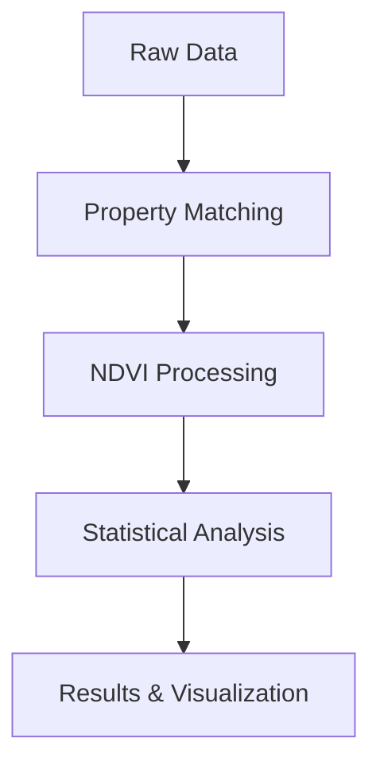

# Heirs Property Analysis System

A spatial data analysis system for tracking and analyzing heirs property parcels in North Carolina.



## Project Status

- Phase 1 (Process NC Parcels): 🚧 In Progress
  - Configured data paths and loading
  - Set up project structure
  - Implemented property data processing pipeline
- Phase 2 (Process Heirs Parcels): 🚧 In Progress
  - Created property matching module
  - Implemented validation system
  - Added configuration management
- Phase 3 (Create Set of Heirs' Neighbors): 🚧 In Progress
  - Implemented neighbor matching algorithm
  - Added distance and size-based filtering
  - Created validation reporting
- Phase 4 (Process NDVI Data): 🚧 In Progress
  - Set up NDVI processing pipeline
  - Implemented chunked processing for large datasets
  - Added temporal trend analysis
- Phase 5 (Calculate NDVI for Heirs' Neighbors): 📅 Planned
- Phase 6 (Calculate NDVI for Heirs' Parcels): 📅 Planned
- Phase 7 (Analayze Differences in NDVI): 🚧 In Progress
  - Implemented statistical analysis module
  - Added multiple statistical tests
  - Created visualization system
- Phase 8 (Output Tabular Data): 🚧 In Progress
  - Set up data export pipeline
  - Added parquet file support
  - Implemented validation reporting
- Phase 9 (Output Spatial Data): 📅 Planned
- Phase 10 (Create Reports): 🚧 In Progress
  - Added plotting functionality
  - Implemented statistical reporting
  - Created validation summaries

## Project Structure

```
heirs-property/
├── data/               # Data directory
│   ├── raw/           # Raw input data
│   ├── processed/     # Processed data
│   └── interim/       # Intermediate data
├── docs/              # Documentation
├── notebooks/         # Jupyter notebooks
├── src/              # Source code
│   ├── processing/   # Data processing scripts
│   └── analysis/     # Analysis tools
```

## License

This project is licensed under the MIT License