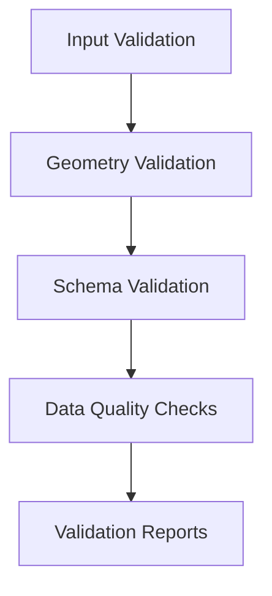
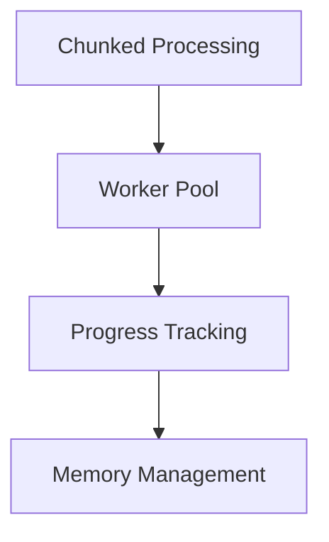
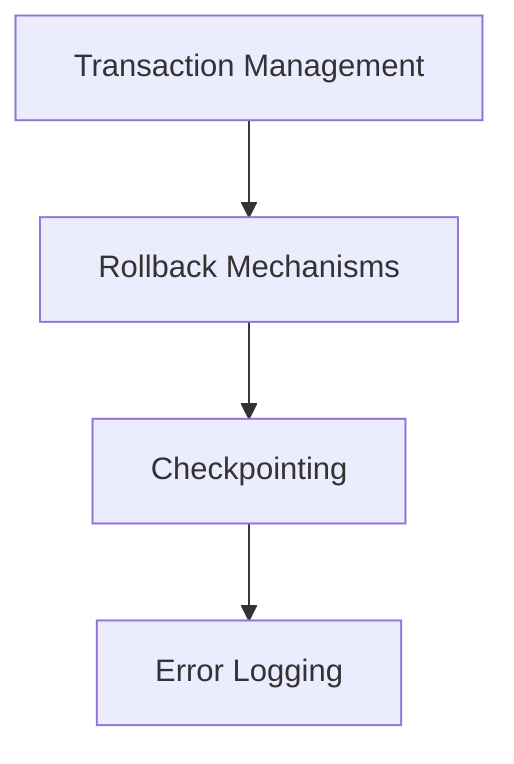
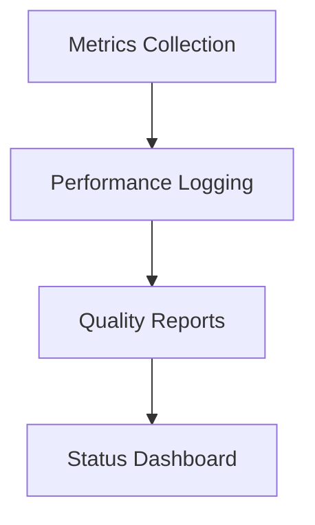

# Phase 2: Data Pipeline Completion Plan

## Overview
This document outlines the plan to complete Phase 2 of the Heirs Property Analysis project, focusing on the data pipeline implementation and optimization.

## Current Status
- ✅ Basic data pipeline infrastructure
- ✅ Initial PostGIS integration
- ✅ Basic parcel processing implementation
- ✅ Environment configuration

## Implementation Plan

### 1. Data Validation Layer (Sprint 2.1)

#### Tasks
- [x] Create `DataValidator` class
- [ ] Implement geometry topology checks
- [ ] Add field validation
- [ ] Set up validation reporting
- [ ] Add tests for validation layer

#### Success Criteria
- All geometry validations pass
- Schema validation complete
- Data quality metrics meet thresholds
- Comprehensive validation reports

### 2. Performance Optimization (Sprint 2.2)

#### Tasks
- [ ] Implement chunked data processing
- [ ] Add parallel processing support
- [ ] Create progress monitoring
- [ ] Optimize memory usage
- [ ] Add performance tests

#### Success Criteria
- Processing time within SLA
- Memory usage optimized
- Efficient parallel processing
- Clear progress reporting

### 3. Error Recovery (Sprint 2.3)

#### Tasks
- [ ] Add database transactions
- [ ] Implement rollback functionality
- [ ] Create checkpoint system
- [ ] Enhance error logging
- [ ] Test error recovery

#### Success Criteria
- Graceful failure recovery
- Complete error logging
- Transaction integrity maintained
- Successful rollback tests

### 4. Pipeline Monitoring (Sprint 2.4)

#### Tasks
- [ ] Set up metrics collection
- [ ] Implement performance logging
- [ ] Create data quality reports
- [ ] Build monitoring dashboard
- [ ] Add monitoring tests

#### Success Criteria
- Real-time pipeline status
- Comprehensive metrics
- Actionable alerts
- Clear performance insights

## Timeline
- Sprint 2.1: Data Validation (3 days)
  - Day 1: Core validation implementation
  - Day 2: Testing and refinement
  - Day 3: Documentation and review

- Sprint 2.2: Performance (3 days)
  - Day 1: Chunked processing implementation
  - Day 2: Parallel processing setup
  - Day 3: Testing and optimization

- Sprint 2.3: Error Recovery (2 days)
  - Day 1: Transaction and rollback implementation
  - Day 2: Testing and documentation

- Sprint 2.4: Monitoring (2 days)
  - Day 1: Metrics and logging setup
  - Day 2: Dashboard implementation

## Dependencies

## Testing Strategy
1. Unit Tests
   - Validation functions
   - Processing components
   - Error handling
   - Monitoring metrics

2. Integration Tests
   - End-to-end pipeline
   - Error recovery scenarios
   - Performance benchmarks

3. Performance Tests
   - Large dataset processing
   - Memory usage patterns
   - Processing time metrics

## Documentation Requirements
1. Technical Documentation
   - Architecture overview
   - Component interactions
   - Configuration guide

2. User Documentation
   - Pipeline usage guide
   - Error troubleshooting
   - Monitoring guide

3. API Documentation
   - Class documentation
   - Method signatures
   - Usage examples

## Risk Management
1. Data Integrity
   - Regular validation checks
   - Transaction management
   - Backup procedures

2. Performance
   - Resource monitoring
   - Optimization strategies
   - Scaling plans

3. Error Handling
   - Comprehensive logging
   - Recovery procedures
   - Alert mechanisms

## Next Steps
1. Begin with Data Validation implementation
2. Set up testing infrastructure
3. Implement core processing logic
4. Add monitoring and reporting

## Success Metrics
1. Data Quality
   - 100% geometry validation
   - Complete field validation
   - No data loss during processing

2. Performance
   - Processing time < 30 minutes for full dataset
   - Memory usage < 4GB
   - CPU utilization < 80%

3. Reliability
   - 99.9% pipeline success rate
   - < 1% error rate
   - 100% data recovery on failure

## Review Process
1. Code Review
   - Pull request reviews
   - Test coverage checks
   - Documentation review

2. Performance Review
   - Benchmark results
   - Resource utilization
   - Optimization opportunities

3. Documentation Review
   - Technical accuracy
   - Completeness
   - User friendliness 