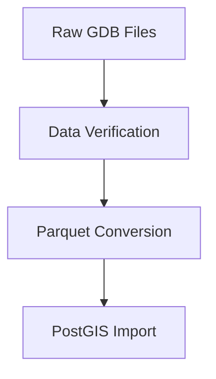
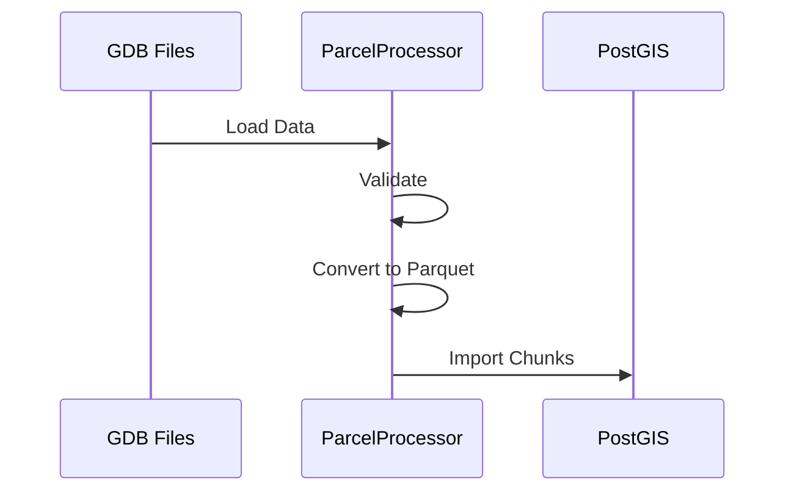

# Heirs Property Data Pipeline Execution Plan

## Overview
This document outlines the end-to-end execution plan for processing heirs property data through our pipeline infrastructure.

## 1. Environment Setup

### A. Infrastructure Verification
- [ ] Docker containers running
  - Processing container
  - PostGIS container
  - JupyterLab container
- [ ] Network connectivity between containers
- [ ] Volume mounts configured

### B. Database Configuration
- [ ] PostGIS connection verification
- [ ] Schema creation
- [ ] Spatial extensions enabled
- [ ] Permissions configured

### C. Processing Parameters
```python
pipeline_config = {
    'chunk_size': 10000,
    'max_workers': 4,
    'memory_limit_mb': 1000,
    'srid': 2264,  # NC State Plane
    'schema': 'public'
}
```

## 2. Data Preparation

### A. GIS Data Requirements


1. Source Files:
   - `NC.gdb`: North Carolina parcel data
   - `HP_Deliverables.gdb`: Heirs property data
   Location: `src/data/raw/gis/`

2. Conversion Process:
   - Convert GDB to Parquet format
   - Validate spatial integrity
   - Check required fields

### B. FIA Plot Data Requirements
1. Source Files:
   - `nc-fia-plots.csv`
   - `nc-plots.csv`
   Location: `src/data/raw/`

2. Validation Steps:
   - Schema verification
   - Coordinate system check
   - Data completeness check

### C. NDVI Data Requirements
1. Source Data:
   - NAIP imagery (Vance County)
   - Years: 2018, 2020, 2022
   Location: `src/data/raw/ndvi/`

## 3. Processing Pipeline Configuration

### A. ChunkedProcessor Setup
```python
chunked_processor = ChunkedProcessor(
    chunk_size=10000,
    max_workers=4,
    memory_limit_mb=1000
)
```

### B. Data Validation Configuration
```python
validator = DataValidator(
    required_fields=['geometry', 'parcel_id'],
    geometry_type='Polygon',
    srid=2264
)
```

### C. Pipeline Monitoring Setup
```python
monitor = PipelineMonitor(
    metrics_dir='metrics/',
    resource_interval=30,
    alert_thresholds={
        'cpu': 80.0,
        'memory': 80.0,
        'disk': 80.0
    }
)
```

## 4. Execution Sequence

### A. Initial Data Import


### B. Processing Steps
1. GDB → Parquet Conversion
   ```python
   parcel_processor.process_gdb(
       gdb_path='src/data/raw/gis/NC.gdb',
       layer_name='parcels'
   )
   ```

2. Heirs Property Processing
   ```python
   hp_processor.process_data(
       input_path='src/data/processed/nc-hp.parquet'
   )
   ```

3. FIA Plot Analysis
   ```python
   plot_analyzer.analyze_plots(
       fia_path='src/data/raw/nc-fia-plots.csv',
       plots_path='src/data/raw/nc-plots.csv'
   )
   ```

## 5. Validation Requirements

### A. Input Validation
- File existence
- Schema conformity
- Spatial integrity
- Data completeness

### B. Processing Validation
- Chunk processing success
- Memory usage within limits
- Error rate monitoring
- Data quality checks

### C. Output Validation
- Record count verification
- Spatial topology checks
- Relationship integrity
- Statistical validation

## 6. Monitoring and Logging

### A. Processing Metrics
- Memory usage
- CPU utilization
- Processing time per chunk
- Error rates

### B. Data Quality Metrics
- Record counts
- Null value percentages
- Geometry validity
- Relationship integrity

### C. Performance Metrics
- Database query times
- Processing throughput
- Memory efficiency
- I/O performance

## 7. Error Recovery

### A. Checkpoint System
- Transaction checkpoints
- Progress tracking
- State persistence

### B. Error Handling
- Failed chunk retry
- Transaction rollback
- Error logging
- Alert system

## Next Steps

1. **Immediate Actions**
   - [ ] Verify data availability
   - [ ] Configure database schema
   - [ ] Set processing parameters

2. **Validation Steps**
   - [ ] Test with sample data
   - [ ] Verify monitoring
   - [ ] Check error handling

3. **Production Deployment**
   - [ ] Full data processing
   - [ ] Performance monitoring
   - [ ] Results validation
``` 