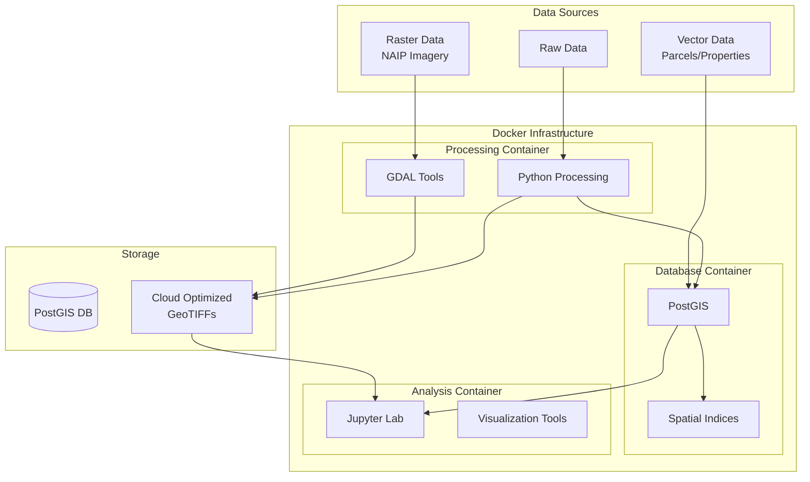
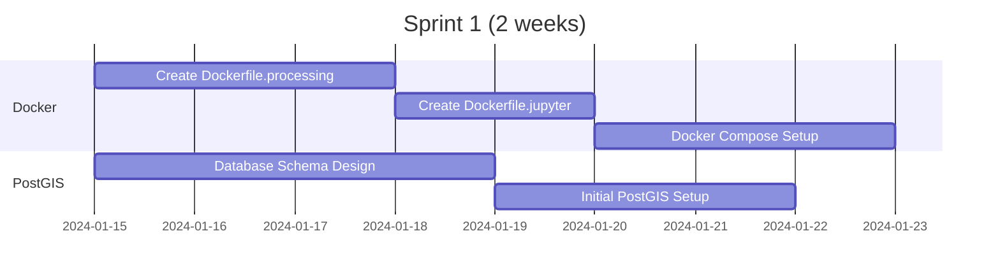
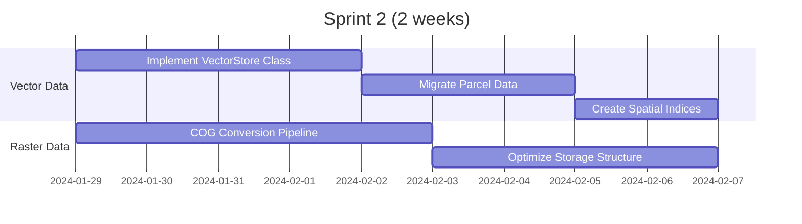
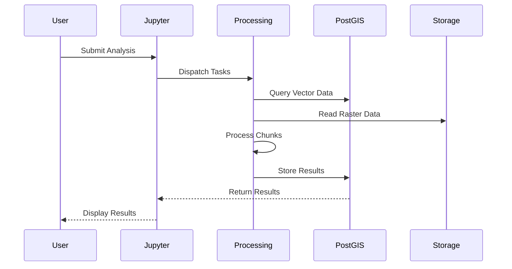
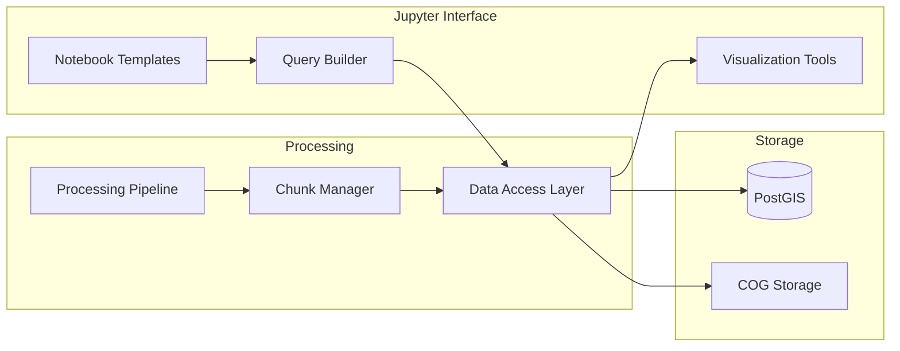
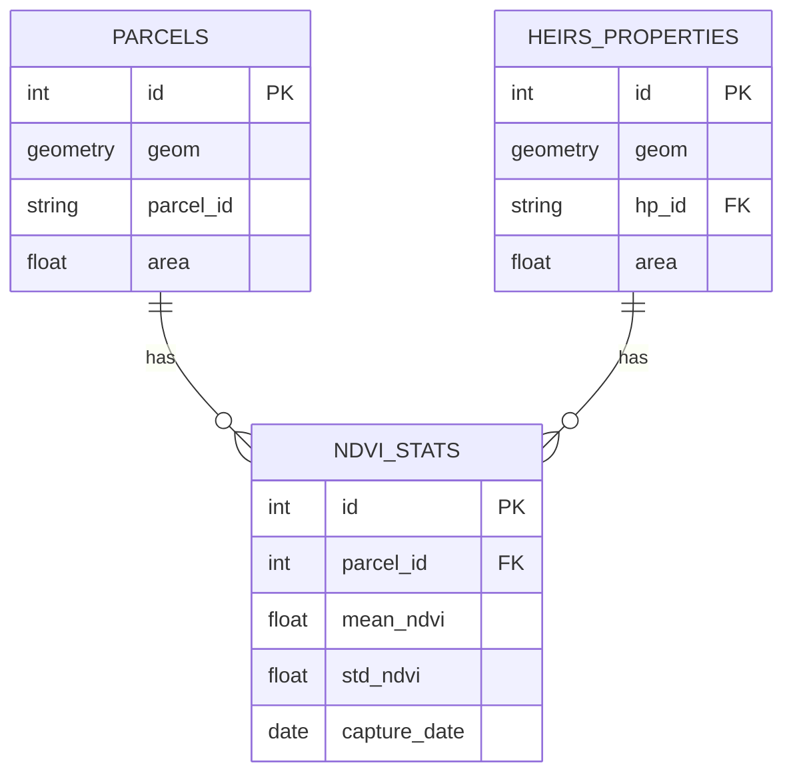
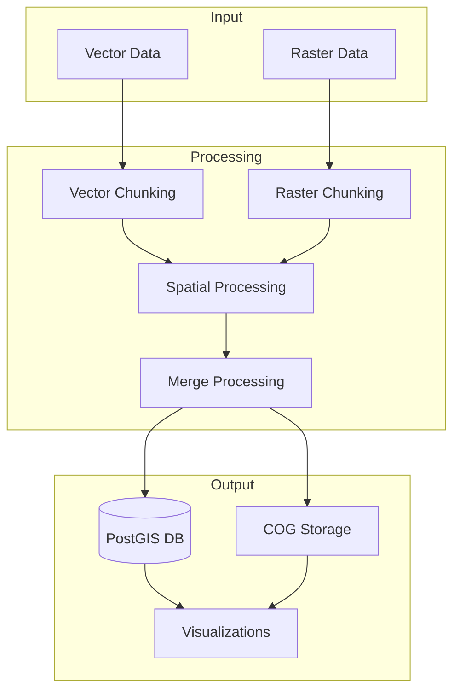
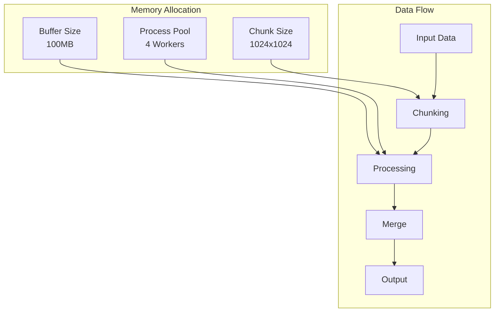

# Containerization and PostGIS Implementation Plan

## Overview
This document outlines the plan to implement Docker containers and PostGIS for the Heirs Property Analysis project, focusing on efficient handling of large-scale geospatial data.

## Architecture

## Sprint Plan

### Sprint 1: Infrastructure Setup
**Goal**: Set up basic containerized environment

#### Tasks
- [ ] Create base Docker configuration
- [ ] Set up PostGIS container
- [ ] Configure networking
- [ ] Test basic connectivity
- [ ] Document setup process

### Sprint 2: Data Migration
**Goal**: Implement data storage strategy

#### Tasks
- [ ] Implement vector data migration
- [ ] Convert NAIP imagery to COGs
- [ ] Create spatial indices
- [ ] Validate data integrity
- [ ] Performance testing

### Sprint 3: Processing Pipeline
**Goal**: Implement distributed processing

#### Tasks
- [ ] Implement chunked processing
- [ ] Set up distributed computing
- [ ] Create processing pipelines
- [ ] Implement error handling
- [ ] Add monitoring

### Sprint 4: Analysis Tools
**Goal**: Develop analysis interface

#### Tasks
- [ ] Create notebook templates
- [ ] Implement visualization tools
- [ ] Build query interface
- [ ] Add documentation
- [ ] User testing

## Implementation Details

### Database Schema

### Processing Flow

## Performance Considerations

### Memory Management

### Monitoring
- Container health checks
- Processing metrics
- Database performance
- Storage utilization

## Next Steps
1. Set up development environment
2. Create initial containers
3. Test with sample data
4. Implement monitoring
5. Document deployment process 