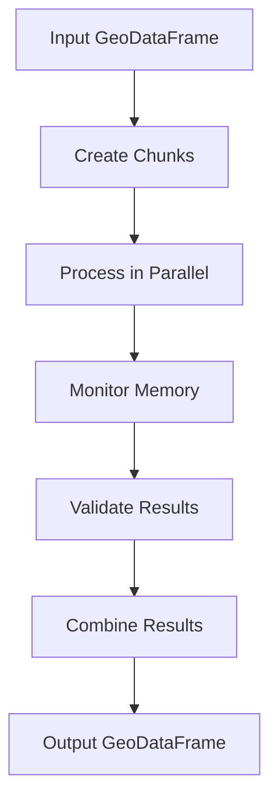

# Chunked Processor Documentation

## Overview
The `ChunkedProcessor` module provides efficient processing of large GeoDataFrames by splitting them into manageable chunks and processing them in parallel. It includes memory monitoring, error handling, and detailed processing statistics.

## Core Components

### ProcessingStats
```python
@dataclass
class ProcessingStats:
    start_time: str
    end_time: Optional[str]
    total_chunks: int
    processed_chunks: int
    failed_chunks: list
    total_records: int
    processed_records: int
    memory_usage: Dict[str, float]
```

Tracks processing statistics including:
- Processing time
- Success/failure counts
- Memory usage per chunk
- Record counts

### ChunkedProcessor
```python
class ChunkedProcessor:
    def __init__(
        self,
        chunk_size: int = 1000,
        max_workers: int = 4,
        memory_limit_mb: float = 1000.0
    )
```

Main processor class with configurable:
- Chunk size
- Worker count
- Memory limits

## Usage Examples

### Basic Processing
```python
from processing.chunked_processor import ChunkedProcessor

# Initialize processor
processor = ChunkedProcessor(
    chunk_size=1000,
    max_workers=4,
    memory_limit_mb=500
)

# Process GeoDataFrame
result, stats = processor.process_geodataframe(
    gdf,
    process_func=my_process_func
)
```

### Parquet File Processing
```python
# Process Parquet file
result, stats = processor.process_parquet(
    "path/to/file.parquet",
    process_func=my_process_func
)
```

## Implementation Details

### Chunk Processing Flow


### Error Handling
- Failed chunks are tracked
- Processing continues despite individual chunk failures
- Detailed error reporting in stats

### Memory Management
- Per-process memory monitoring
- Configurable memory limits
- Resource usage tracking

## Testing

The module includes comprehensive tests covering:
- Chunk size calculation
- Parallel processing
- Memory monitoring
- Progress tracking
- Error handling
- Parquet file processing
- Worker management
- Memory limit handling
- Concurrent processing
- Statistics serialization

## Change History

### Version 0.1.0
- Initial implementation
- Basic chunked processing
- Memory monitoring
- Error handling

### Version 0.1.1
- Added Parquet file support
- Improved GeoDataFrame handling
- Enhanced error reporting

## Related Documents
- [Implementation Steps](implementation_steps.md)
- [Containerization Plan](containerization_plan.md)

## Status
✅ Complete | Ready for Production

## Location
`src/processing/chunked_processor.py` 