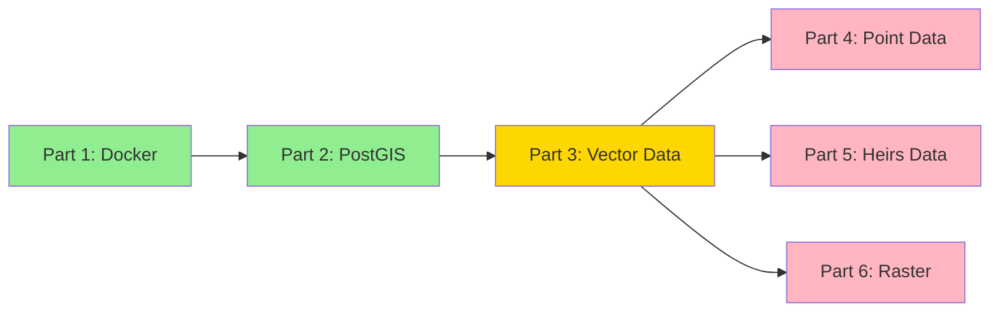

# Project Status (January 2024)

## Overall Progress


## Completed Milestones

### Part 1: Docker Setup ✅ (January 2024)
- [x] Base environment with GDAL
- [x] Multi-container setup (processing, jupyter, postgis)
- [x] Development environment configuration
- [x] Volume and network configuration
- [x] Container health checks
- [x] Environment variable configuration

### Part 2: PostGIS Setup ✅ (January 2024)
- [x] Database initialization
- [x] Spatial configuration
- [x] Performance optimization
- [x] Testing and validation
- [x] Connection verification
- [x] NC State Plane (SRID: 2264) configuration

## Current Phase

### Part 3: Vector-Based Parcel Data 🔄 (January 2024)

#### Infrastructure (Completed)
- [x] ChunkedProcessor implementation
- [x] Parallel processing framework
- [x] Memory monitoring
- [x] Basic error handling
- [x] Initial testing framework
- [x] Docker networking
- [x] Database connectivity

#### In Progress
- [ ] Database schema creation
- [ ] Data validation layer
- [ ] Error recovery system
- [ ] Pipeline monitoring
- [ ] Spatial processing setup

## Upcoming Phases

### Part 4: Point-Based Forest Inventory
- Scheduled: Mid-January 2024
- Dependencies: Part 3 completion
- Status: Pending

### Part 5: Heirs Property Data
- Scheduled: Late January 2024
- Dependencies: Part 3 completion
- Status: Pending

### Part 6: Raster Data
- Scheduled: Early February 2024
- Dependencies: Parts 3-5 completion
- Status: Pending

## Recent Updates

| Component | Status | Last Updated | Notes |
|-----------|--------|--------------|-------|
| Docker Environment | ✅ Complete | Jan 2024 | All containers running |
| PostGIS Setup | ✅ Complete | Jan 2024 | Database configured |
| Data Pipeline | 🔄 In Progress | Jan 2024 | Basic framework ready |
| Schema Design | ⏳ Pending | - | Starting soon |

## Next Steps

1. Database Schema Creation
   - Design table structures
   - Create spatial indices
   - Set up relationships
   - Configure constraints

2. Data Import Pipeline
   - Implement GDB to Parquet conversion
   - Set up validation rules
   - Create import procedures
   - Configure error handling

3. Processing Framework
   - Complete chunked processing
   - Implement monitoring
   - Set up error recovery
   - Add progress tracking

## Technical Details

### Environment Configuration
```python
pipeline_config = {
    'chunk_size': 10000,
    'max_workers': 4,
    'memory_limit_mb': 1000,
    'srid': 2264  # NC State Plane
}
```

### Database Configuration
- Host: PostGIS container
- Port: 5432
- Database: heirs_property
- Extensions: PostGIS enabled
- Spatial Reference: NC State Plane (2264)

### Processing Infrastructure
- Python 3.9
- GDAL support
- Parallel processing
- Memory monitoring
- Error tracking

## Risk Assessment

| Risk | Impact | Mitigation | Status |
|------|---------|------------|--------|
| Data Volume | High | Chunked processing | ✅ Implemented |
| Memory Usage | Medium | Memory monitoring | ✅ Implemented |
| Processing Time | Medium | Parallel processing | ✅ Implemented |
| Data Integrity | High | Validation framework | 🔄 In Progress |

## Documentation Status

| Document | Status | Last Updated |
|----------|---------|--------------|
| Implementation Steps | ✅ Updated | Jan 2024 |
| Containerization Plan | ✅ Complete | Jan 2024 |
| Pipeline Documentation | 🔄 Updating | Jan 2024 |
| Technical Docs | 🔄 Updating | Jan 2024 | 