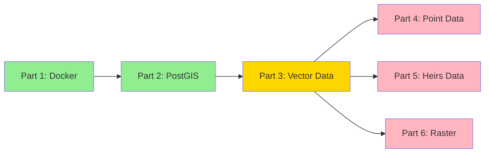

# Heirs Property Project Status
*Last Updated: 2024-01-04*

## Project Overview
A spatial data analysis system for tracking and analyzing heirs property parcels in North Carolina, focusing on forest health quantification and comparative analysis.

## Overall Progress


## Phase Status

### Phase 1: Infrastructure ✅ Complete
**Core Infrastructure**
- ✅ PostgreSQL/PostGIS container with NC State Plane support
- ✅ JupyterLab environment for data analysis
- ✅ Docker environment and networking
- ✅ Testing framework implementation
- ✅ Documentation structure

**Database Setup**
- ✅ PostGIS extensions and spatial functions
- ✅ Schema initialization
- ✅ Performance optimization
- ✅ Security configuration

### Phase 2: Data Pipeline 🔄 In Progress
**Current Implementation**
- ✅ Basic pipeline infrastructure
- ✅ Initial PostGIS integration
- ✅ Basic parcel processing
- 🔄 Data validation layer
- ⏳ Performance optimization
- ⏳ Error recovery system
- ⏳ Pipeline monitoring

**Next Steps**
1. Complete data validation implementation
2. Implement chunked processing
3. Add error recovery mechanisms
4. Set up monitoring system

### Phase 3: Analysis Tools 📅 Planned
**Upcoming Features**
- Advanced spatial analysis
- Visualization tools
- Reporting framework
- Performance optimization

## Current Focus
1. Data Pipeline Components
   - Implementing validation layer
   - Setting up chunked processing
   - Planning error recovery system

2. Analysis Framework
   - NDVI analysis methodology
   - Property comparison framework
   - Statistical methods

## Technical Details

### Environment Configuration
```python
pipeline_config = {
    'chunk_size': 10000,
    'max_workers': 4,
    'memory_limit_mb': 1000,
    'srid': 2264  # NC State Plane
}
```

### Database Configuration
- Host: PostGIS container
- Port: 5432
- Database: heirs_property
- Extensions: PostGIS enabled
- Spatial Reference: NC State Plane (2264)

### Processing Infrastructure
- Python 3.9
- GDAL support
- Parallel processing
- Memory monitoring
- Error tracking

## Risk Assessment

| Risk | Impact | Mitigation | Status |
|------|---------|------------|--------|
| Data Volume | High | Chunked processing | ✅ Implemented |
| Memory Usage | Medium | Memory monitoring | ✅ Implemented |
| Processing Time | Medium | Parallel processing | ✅ Implemented |
| Data Integrity | High | Validation framework | 🔄 In Progress |

## Known Issues & Risks
1. Data Coverage
   - Only 10.2% of Vance County heirs properties have NDVI coverage
   - Investigation needed for coverage gaps

2. Processing Performance
   - Large dataset handling needs optimization
   - Memory usage monitoring required

## Dependencies
- ✅ PostGIS extensions
- ✅ Python environment
- ✅ Docker setup
- ✅ Testing frameworks

## Success Metrics
1. Data Quality
   - Complete geometry validation
   - Field validation
   - No data loss during processing

2. Performance
   - Efficient large dataset processing
   - Optimized memory usage
   - Reliable error recovery

3. Analysis
   - Accurate NDVI calculations
   - Reliable property comparisons
   - Statistical significance in results

## Recent Updates

| Component | Status | Last Updated | Notes |
|-----------|--------|--------------|-------|
| Docker Environment | ✅ Complete | Jan 2024 | All containers running |
| PostGIS Setup | ✅ Complete | Jan 2024 | Database configured |
| Data Pipeline | 🔄 In Progress | Jan 2024 | Basic framework ready |
| Schema Design | ⏳ Pending | - | Starting soon | 