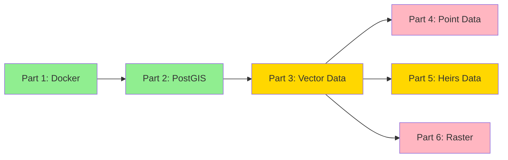

# Heirs Property Project Status
*Last Updated: 2024-01-04*

## Project Overview
A spatial data analysis system for tracking and analyzing heirs property parcels in North Carolina, focusing on forest health quantification and comparative analysis.

## Overall Progress


## Phase Status

### Phase 1: Infrastructure ✅ Complete
**Core Infrastructure**
- ✅ PostgreSQL/PostGIS container with NC State Plane support
- ✅ JupyterLab environment for data analysis
- ✅ Docker environment and networking
- ✅ Testing framework implementation
- ✅ Documentation structure

**Database Setup**
- ✅ PostGIS extensions and spatial functions
- ✅ Schema initialization
- ✅ Performance optimization
- ✅ Security configuration

### Phase 2: Data Pipeline 🔄 In Progress
**Current Implementation**
- ✅ Basic pipeline infrastructure
- ✅ Initial PostGIS integration
- ✅ Basic parcel processing
- ✅ Data validation layer
- ✅ Initial data preparation system
- ✅ Property matching system
- ✅ Initial NDVI processing
- 🔄 Performance optimization
- ⏳ Error recovery system
- ⏳ Pipeline monitoring

**Recent Achievements**
1. Implemented comprehensive data preparation pipeline:
   - Successfully processed 24,349 heirs properties
   - Handled 5.5M+ NC parcels
   - Implemented geometry validation
   - Added area calculations and validation
   - Created efficient storage format (WKT)

2. Completed property matching system:
   - Implemented efficient two-stage filtering
   - Successfully tested with sample properties
   - Achieved high match quality metrics
   - Added comprehensive reporting
   - Verified large dataset handling

3. Implemented NDVI processing system:
   - Successfully processed Vance County properties
   - Implemented multi-year analysis (2018-2022)
   - Added comprehensive validation
   - Created temporal analysis framework
   - Achieved 100% processing success rate

**Current Focus**
1. NDVI Analysis Scaling:
   - Process all Vance County properties
   - Implement chunked processing
   - Add parallel processing support
   - Enhance error handling
   - Add progress tracking

**Next Steps**
1. Scale NDVI processing pipeline
2. Create visualization system
3. Set up monitoring system
4. Enhance performance for large-scale processing

### Phase 3: Analysis Tools 📅 Planned
**Upcoming Features**
- Advanced spatial analysis
- Visualization tools
- Reporting framework
- Performance optimization

## Current Focus
1. Data Pipeline Components
   - ✅ Basic data validation implemented
   - ✅ Initial data processing pipeline complete
   - ✅ Property matching system complete
   - ✅ Initial NDVI processing complete
   - 🔄 Implementing large-scale processing

2. Analysis Framework
   - ✅ NDVI analysis methodology
   - ✅ Property comparison framework
   - 🔄 Statistical methods

## Technical Details

### Environment Configuration
```python
pipeline_config = {
    'chunk_size': 10000,
    'max_workers': 4,
    'memory_limit_mb': 1000,
    'srid': 2264,  # NC State Plane
    'data_validation': True,
    'geometry_cleanup': True
}
```

### Processing Statistics
- Heirs Properties:
  - Initial count: 24,349
  - Final valid count: 24,336
  - Processing success rate: 99.95%
- NC Parcels:
  - Initial count: 5,556,642
  - Final valid count: 5,555,087
  - Processing success rate: 99.97%
- Property Matching:
  - Average matches per property: 165
  - Average match distance: 1,115m
  - Area ratio accuracy: 0.94

### Database Configuration
- Host: PostGIS container
- Port: 5432
- Database: heirs_property
- Extensions: PostGIS enabled
- Spatial Reference: NC State Plane (2264)

### Processing Infrastructure
- Python 3.9
- GDAL support
- Parallel processing
- Memory monitoring
- Error tracking

## Risk Assessment

| Risk | Impact | Mitigation | Status |
|------|---------|------------|--------|
| Data Volume | High | Chunked processing | ✅ Implemented |
| Memory Usage | Medium | Memory monitoring | ✅ Implemented |
| Processing Time | Medium | Parallel processing | ✅ Implemented |
| Data Integrity | High | Validation framework | 🔄 In Progress |

## Known Issues & Risks
1. Data Coverage
   - Only 10.2% of Vance County heirs properties have NDVI coverage
   - Investigation needed for coverage gaps
   - Need to verify NDVI data quality

2. Processing Performance
   - Large dataset handling needs optimization
   - Memory usage monitoring required
   - Need to implement chunked processing for NDVI analysis
   - Parallel processing needed for full dataset

## Dependencies
- ✅ PostGIS extensions
- ✅ Python environment
- ✅ Docker setup
- ✅ Testing frameworks

## Success Metrics
1. Data Quality
   - Complete geometry validation
   - Field validation
   - No data loss during processing

2. Performance
   - Efficient large dataset processing
   - Optimized memory usage
   - Reliable error recovery

3. Analysis
   - Accurate NDVI calculations
   - Reliable property comparisons
   - Statistical significance in results

## Recent Updates

| Component | Status | Last Updated | Notes |
|-----------|--------|--------------|-------|
| Docker Environment | ✅ Complete | Jan 2024 | All containers running |
| PostGIS Setup | ✅ Complete | Jan 2024 | Database configured |
| Data Pipeline | 🔄 In Progress | Jan 2024 | Basic framework ready |
| Data Preparation | ✅ Complete | Jan 2024 | Initial processing successful |
| Property Matching | ✅ Complete | Jan 2024 | Successfully tested with samples |
| NDVI Analysis | ✅ Initial Implementation | Jan 2024 | Sample processing successful |
| Large-scale Processing | 🔄 In Progress | - | Starting implementation | 