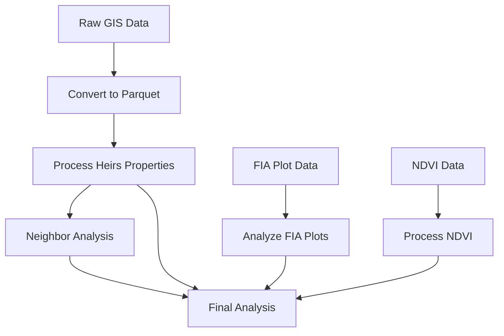
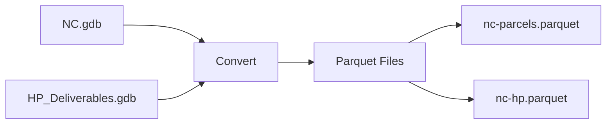
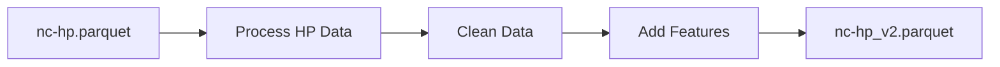
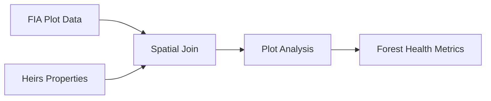
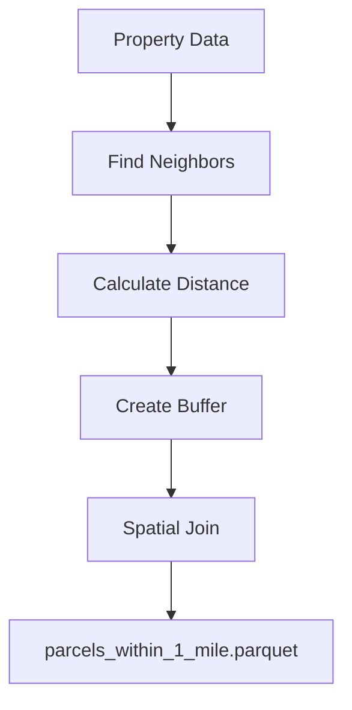
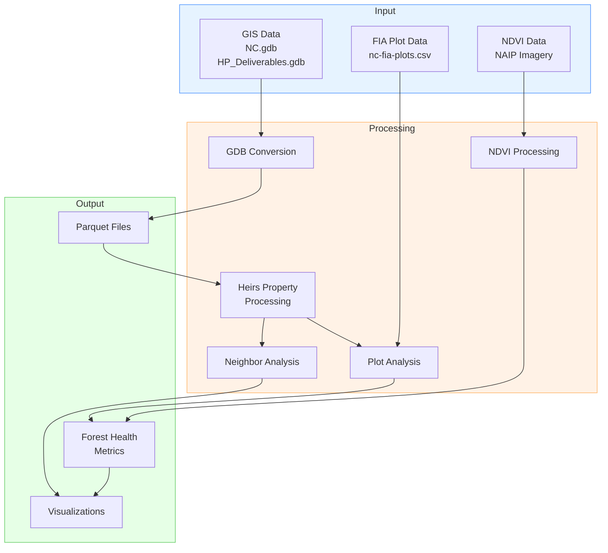
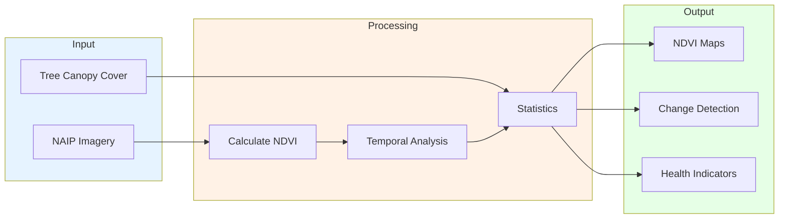
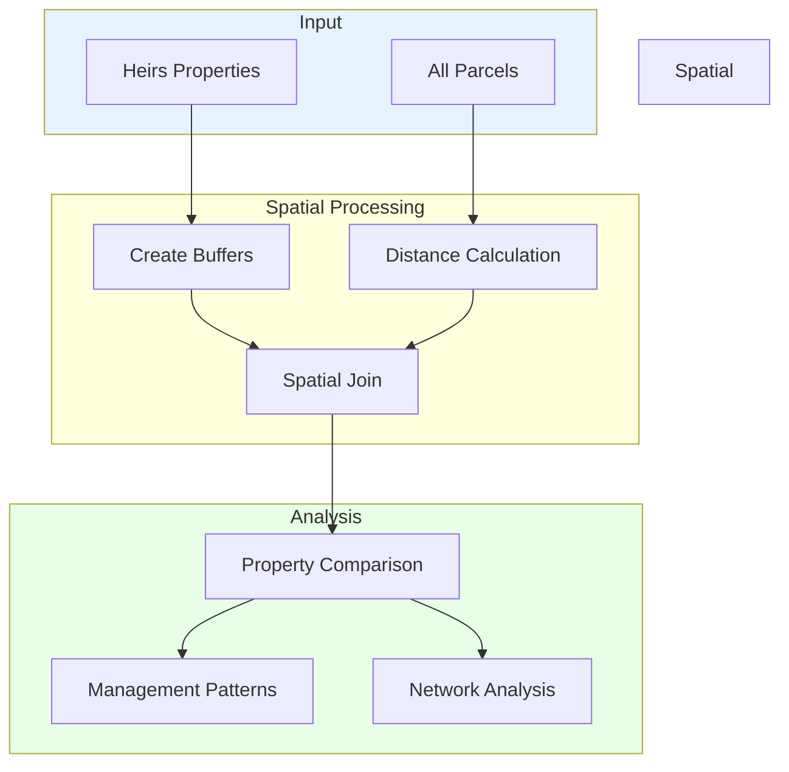
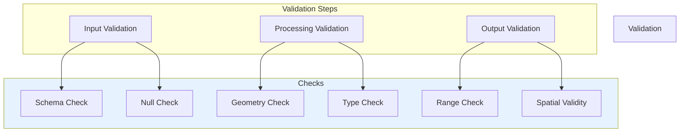

# Heirs Property Analysis Data Pipeline

This document outlines the data processing pipeline for analyzing heirs properties in North Carolina, focusing on land management patterns and forest health indicators.

## Pipeline Overview



## Data Sources

### 1. GIS Data
- Location: `src/data/raw/gis/`
- Files:
  - `NC.gdb`: North Carolina parcel data
  - `HP_Deliverables.gdb`: Heirs property data
  - `HP_Deliverables.gdb.zip`: Backup of heirs property data

### 2. FIA Plot Data
- Location: `src/data/raw/`
- Files:
  - `nc-fia-plots.csv`: Forest Inventory Analysis plot data
  - `nc-plots.csv`: Additional plot information

### 3. NDVI Data
- Location: `src/data/raw/ndvi/`
- Files:
  - NAIP imagery for Vance County (2018, 2020, 2022)
  - Tree canopy cover data

## Pipeline Stages

### Stage 1: GDB to Parquet Conversion


**Process:**
1. Load GDB files using GeoPandas
2. Clean and standardize fields
3. Convert to Parquet format for efficient processing

### Stage 2: Heirs Property Processing


**Process:**
1. Clean heirs property data
2. Add derived features
3. Validate property information

### Stage 3: FIA Plot Analysis


**Process:**
1. Load and clean FIA plot data
2. Perform spatial join with properties
3. Calculate forest health metrics

### Stage 4: Neighbor Analysis


**Process:**
1. Identify neighboring properties
2. Calculate distances
3. Create property buffers
4. Analyze management patterns

### Stage 5: NDVI Processing


**Process:**
1. Process NAIP imagery
2. Calculate NDVI values
3. Extract temporal patterns
4. Generate property-level statistics

## Output Products

1. **Processed Datasets:**
   - Cleaned heirs property data
   - Property neighbor relationships
   - Forest health indicators

2. **Analysis Results:**
   - Forest management patterns
   - Temporal NDVI changes
   - Property characteristic comparisons

3. **Visualizations:**
   - NDVI change maps
   - Forest health distribution
   - Property relationship networks

## Running the Pipeline

The pipeline can be executed using:

```python
from src.pipeline.data_pipeline import HeirsPropertyPipeline, PipelineConfig

config = PipelineConfig(
    raw_gis_dir=Path("src/data/raw/gis"),
    processed_dir=Path("src/data/processed"),
    ndvi_dir=Path("src/data/raw/ndvi")
)

pipeline = HeirsPropertyPipeline(config)
pipeline.run_pipeline()
```

## Dependencies

- GeoPandas
- Pandas
- Rasterio
- NumPy
- Shapely

## Error Handling

The pipeline includes comprehensive error handling for:
- Missing input files
- Invalid data formats
- Processing failures
- Output validation

## Monitoring

Pipeline progress is monitored through:
- Logging to file and console
- Progress indicators for long-running processes
- Data validation checks
- Error reporting 

# Heirs Property Analysis Data Pipeline

## Complete Data Flow


## Data Processing Detail
```mermaid
flowchart LR
    subgraph GIS Processing
        direction TB
        GDB[GDB Files] --> CLEAN[Clean & Standardize]
        CLEAN --> PAR[Parquet Format]
    end

    subgraph Heirs Analysis
        direction TB
        HP[Heirs Properties] --> FEAT[Feature Engineering]
        FEAT --> VALID[Validation]
        VALID --> FINAL[Final Dataset]
    end

    subgraph Forest Health
        direction TB
        FIA[FIA Plots] --> JOIN[Spatial Join]
        JOIN --> METRICS[Health Metrics]
        NDVI[NDVI Data] --> TEMP[Temporal Analysis]
        TEMP --> METRICS
    end

    GIS Processing --> Heirs Analysis
    Heirs Analysis --> Forest Health

    style GIS Processing fill:#e6f3ff
    style Heirs Analysis fill:#fff2e6
    style Forest Health fill:#e6ffe6
```

## NDVI Processing Pipeline


## Neighbor Analysis Detail


## Data Validation Flow
