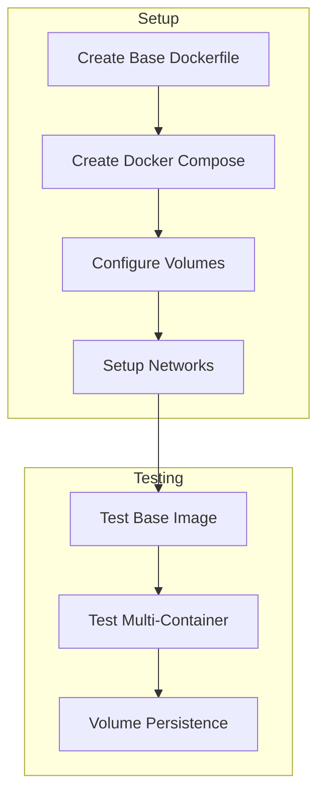
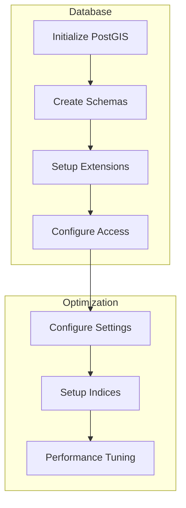
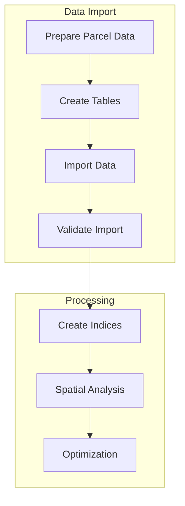
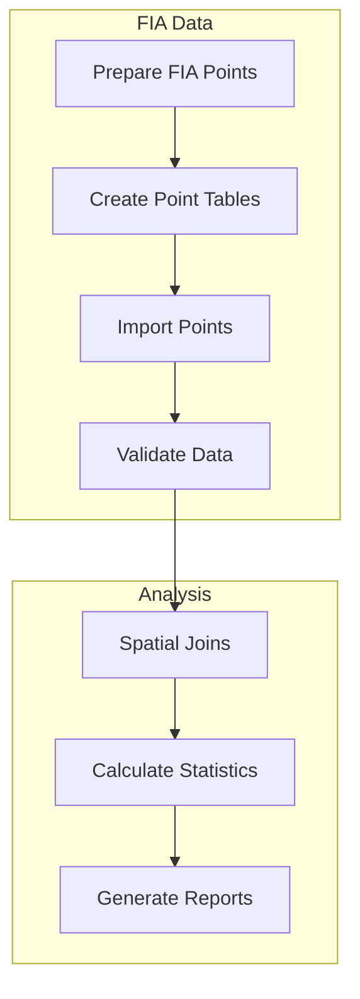
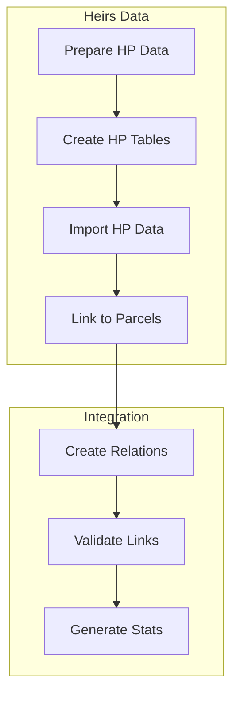
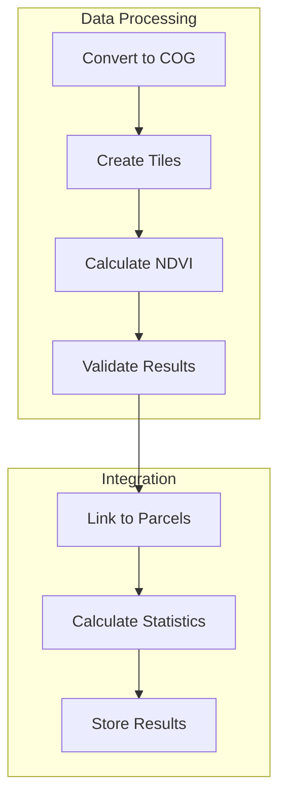
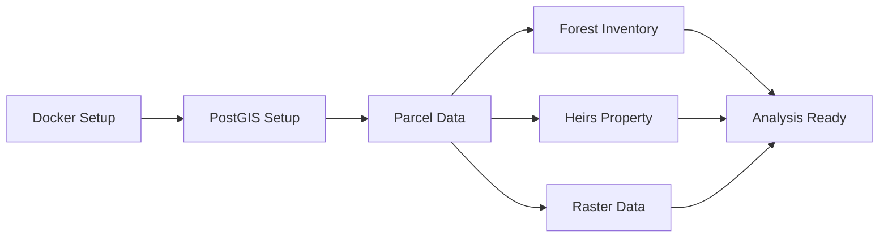

# Heirs Property Analysis Implementation Steps

## Part 1: Docker Setup and Configuration

### Steps
1. **Base Environment Setup**
   - [ ] Create Python base image with GDAL
   - [ ] Configure environment variables
   - [ ] Set up workspace structure
   - [ ] Test base container

2. **Docker Compose Configuration**
   - [ ] Define services (processing, jupyter, postgis)
   - [ ] Configure networking
   - [ ] Set up volume mounts
   - [ ] Test multi-container communication

3. **Development Environment**
   - [ ] Configure VSCode integration
   - [ ] Set up debugging
   - [ ] Configure hot reloading
   - [ ] Test development workflow

## Part 2: PostGIS Setup and Configuration

### Steps
1. **Database Initialization**
   - [ ] Set up PostGIS container
   - [ ] Configure authentication
   - [ ] Create database schemas
   - [ ] Test connections

2. **Spatial Configuration**
   - [ ] Enable PostGIS extensions
   - [ ] Configure spatial reference systems
   - [ ] Set up spatial indices
   - [ ] Test spatial queries

3. **Performance Optimization**
   - [ ] Configure memory settings
   - [ ] Optimize for spatial operations
   - [ ] Set up query monitoring
   - [ ] Benchmark performance

## Part 3: Vector-Based Parcel Data

### Steps
1. **Data Preparation**
   - [ ] Convert GDB to PostGIS format
   - [ ] Clean and validate data
   - [ ] Create parcel tables
   - [ ] Import initial dataset

2. **Spatial Processing**
   - [ ] Create spatial indices
   - [ ] Set up neighbor analysis
   - [ ] Configure area calculations
   - [ ] Test spatial queries

3. **Optimization**
   - [ ] Analyze query patterns
   - [ ] Optimize table structure
   - [ ] Configure partitioning
   - [ ] Test performance

## Part 4: Point-Based Forest Inventory Data

### Steps
1. **Point Data Setup**
   - [ ] Prepare FIA point data
   - [ ] Create point tables
   - [ ] Import point data
   - [ ] Validate coordinates

2. **Spatial Analysis**
   - [ ] Set up point-in-polygon analysis
   - [ ] Create buffer operations
   - [ ] Configure spatial joins
   - [ ] Test point queries

3. **Statistics Generation**
   - [ ] Calculate plot statistics
   - [ ] Generate summaries
   - [ ] Create reports
   - [ ] Validate results

## Part 5: Vector-Based Heirs Property Data

### Steps
1. **Data Integration**
   - [ ] Prepare heirs property data
   - [ ] Create relationship tables
   - [ ] Import HP data
   - [ ] Link to parcels

2. **Relationship Management**
   - [ ] Set up foreign keys
   - [ ] Create integrity constraints
   - [ ] Configure cascading updates
   - [ ] Test relationships

3. **Analysis Setup**
   - [ ] Create comparison views
   - [ ] Set up analysis functions
   - [ ] Configure reporting
   - [ ] Validate analysis

## Part 6: Raster Data Management

### Steps
1. **Raster Optimization**
   - [ ] Convert NAIP imagery to Cloud-Optimized GeoTIFFs
   - [ ] Implement tiling strategy
   - [ ] Set up efficient storage structure
   - [ ] Test access patterns

2. **NDVI Processing**
   - [ ] Calculate NDVI from bands
   - [ ] Implement chunked processing
   - [ ] Optimize memory usage
   - [ ] Validate calculations

3. **Integration with Vector Data**
   - [ ] Link raster stats to parcels
   - [ ] Calculate zonal statistics
   - [ ] Store results in PostGIS
   - [ ] Test performance

## Dependencies and Order

## Success Criteria
1. **Docker Environment**
   - All containers running
   - Volume persistence working
   - Development workflow smooth

2. **PostGIS**
   - Database optimized
   - Spatial operations fast
   - Connections stable

3. **Parcel Data**
   - Clean import
   - Spatial queries efficient
   - Relationships maintained

4. **Forest Inventory**
   - Points accurately mapped
   - Statistics calculated
   - Analysis functions working

5. **Heirs Property**
   - Relationships established
   - Analysis ready
   - Reports generating

6. **Raster Data**
   - COG conversion successful
   - Efficient tiling implemented
   - NDVI calculations accurate
   - Integration with vector data working

## Next Steps
1. Begin with Docker setup (Part 1)
2. Move to PostGIS configuration (Part 2)
3. Import parcel data (Part 3)
4. Add forest inventory (Part 4)
5. Integrate heirs property data (Part 5)
6. Process raster data (Part 6)

Would you like to proceed with implementing any specific part? 