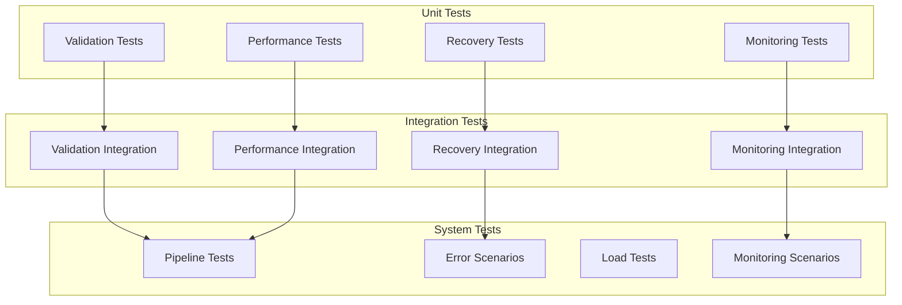

"""
# Phase 2 Test Plan

## Overview
This document outlines the testing strategy for Phase 2 components of the Heirs Property Analysis project, focusing on the four main layers:
1. Data Validation Layer
2. Performance Optimization Layer
3. Error Recovery Layer
4. Pipeline Monitoring Layer

## Test Structure


## Test Categories

### 1. Unit Tests

#### Data Validator Tests (`test_data_validator.py`)
```python
def test_validate_required_fields():
    """Test validation of required fields."""

def test_validate_geometry_type():
    """Test geometry type validation."""

def test_validate_crs():
    """Test coordinate reference system validation."""

def test_validate_topology():
    """Test topology validation."""

def test_validation_report_format():
    """Test validation report structure."""
```

#### Chunked Processor Tests (`test_chunked_processor.py`)
```python
def test_chunk_size_calculation():
    """Test chunk size determination."""

def test_parallel_processing():
    """Test parallel processing functionality."""

def test_memory_monitoring():
    """Test memory usage monitoring."""

def test_progress_tracking():
    """Test progress reporting."""

def test_processing_stats():
    """Test processing statistics generation."""
```

#### Transaction Manager Tests (`test_transaction_manager.py`)
```python
def test_transaction_creation():
    """Test transaction initialization."""

def test_backup_creation():
    """Test backup table creation."""

def test_checkpoint_creation():
    """Test checkpoint file creation."""

def test_rollback_procedure():
    """Test rollback functionality."""

def test_transaction_status():
    """Test transaction status tracking."""
```

#### Pipeline Monitor Tests (`test_pipeline_monitor.py`)
```python
def test_resource_monitoring():
    """Test resource metrics collection."""

def test_alert_thresholds():
    """Test alert generation."""

def test_metrics_storage():
    """Test metrics persistence."""

def test_report_generation():
    """Test report creation."""

def test_monitor_lifecycle():
    """Test monitor start/stop."""
```

### 2. Integration Tests

#### Validation Integration (`test_validation_integration.py`)
```python
def test_validation_pipeline_integration():
    """Test validation in pipeline."""

def test_validation_error_handling():
    """Test error handling in pipeline."""

def test_validation_reporting_flow():
    """Test report generation flow."""
```

#### Performance Integration (`test_performance_integration.py`)
```python
def test_chunked_processing_pipeline():
    """Test chunked processing in pipeline."""

def test_memory_management_integration():
    """Test memory management in pipeline."""

def test_parallel_processing_integration():
    """Test parallel processing in pipeline."""
```

#### Recovery Integration (`test_recovery_integration.py`)
```python
def test_transaction_pipeline_integration():
    """Test transaction management in pipeline."""

def test_recovery_scenario_handling():
    """Test recovery procedures in pipeline."""

def test_checkpoint_recovery_flow():
    """Test checkpoint recovery in pipeline."""
```

#### Monitoring Integration (`test_monitoring_integration.py`)
```python
def test_monitor_pipeline_integration():
    """Test monitoring in pipeline."""

def test_metrics_collection_flow():
    """Test metrics collection in pipeline."""

def test_alert_handling_integration():
    """Test alert handling in pipeline."""
```

### 3. System Tests

#### Pipeline Tests (`test_pipeline_system.py`)
```python
def test_end_to_end_processing():
    """Test complete pipeline execution."""

def test_large_dataset_processing():
    """Test processing of large datasets."""

def test_multiple_dataset_processing():
    """Test concurrent dataset processing."""
```

#### Error Scenarios (`test_error_scenarios.py`)
```python
def test_validation_failure_recovery():
    """Test recovery from validation failures."""

def test_processing_failure_recovery():
    """Test recovery from processing failures."""

def test_transaction_failure_recovery():
    """Test recovery from transaction failures."""
```

#### Load Tests (`test_load.py`)
```python
def test_memory_pressure():
    """Test behavior under memory pressure."""

def test_cpu_pressure():
    """Test behavior under CPU pressure."""

def test_disk_pressure():
    """Test behavior under disk pressure."""
```

#### Monitoring Scenarios (`test_monitoring_scenarios.py`)
```python
def test_resource_threshold_handling():
    """Test handling of resource thresholds."""

def test_long_running_monitoring():
    """Test long-duration monitoring."""

def test_alert_scenario_handling():
    """Test handling of alert scenarios."""
```

## Test Data

### Sample Datasets
1. **Small Test Dataset**: < 1000 records
   - Basic validation scenarios
   - Quick integration tests
   - Error case testing

2. **Medium Test Dataset**: ~100,000 records
   - Performance testing
   - Memory management testing
   - Parallel processing testing

3. **Large Test Dataset**: > 1,000,000 records
   - Load testing
   - System testing
   - Performance benchmarking

### Test Fixtures
```python
@pytest.fixture
def sample_geodataframe():
    """Create sample GeoDataFrame for testing."""

@pytest.fixture
def mock_database():
    """Create mock PostGIS database."""

@pytest.fixture
def test_monitor():
    """Create test monitor instance."""

@pytest.fixture
def test_processor():
    """Create test processor instance."""
```

## Test Environment

### Configuration
```bash
# Test Environment Variables
TEST_CHUNK_SIZE=1000
TEST_MAX_WORKERS=2
TEST_MEMORY_LIMIT=500
TEST_RESOURCE_INTERVAL=5
```

### Directory Structure
```
tests/
├── unit/
│   ├── test_data_validator.py
│   ├── test_chunked_processor.py
│   ├── test_transaction_manager.py
│   └── test_pipeline_monitor.py
├── integration/
│   ├── test_validation_integration.py
│   ├── test_performance_integration.py
│   ├── test_recovery_integration.py
│   └── test_monitoring_integration.py
├── system/
│   ├── test_pipeline_system.py
│   ├── test_error_scenarios.py
│   ├── test_load.py
│   └── test_monitoring_scenarios.py
└── conftest.py
```

## Test Execution

### Running Tests
```bash
# Run all tests
pytest tests/

# Run specific test category
pytest tests/unit/
pytest tests/integration/
pytest tests/system/

# Run with coverage
pytest --cov=src tests/
```

### CI/CD Integration
```yaml
test:
  stage: test
  script:
    - pip install -r requirements-dev.txt
    - pytest tests/ --cov=src
    - coverage report
  artifacts:
    reports:
      coverage: coverage.xml
```

## Success Criteria

### Coverage Targets
- Unit Tests: > 90% coverage
- Integration Tests: > 80% coverage
- System Tests: > 70% coverage

### Performance Targets
- Unit Tests: < 1 second per test
- Integration Tests: < 5 seconds per test
- System Tests: < 30 seconds per test

### Quality Targets
- Zero flaky tests
- Clear test documentation
- Maintainable test code
- Reproducible test results

## Next Steps
1. Implement unit tests for each component
2. Set up test data generation
3. Create integration test environment
4. Configure CI/CD pipeline
5. Add performance benchmarks
""" 